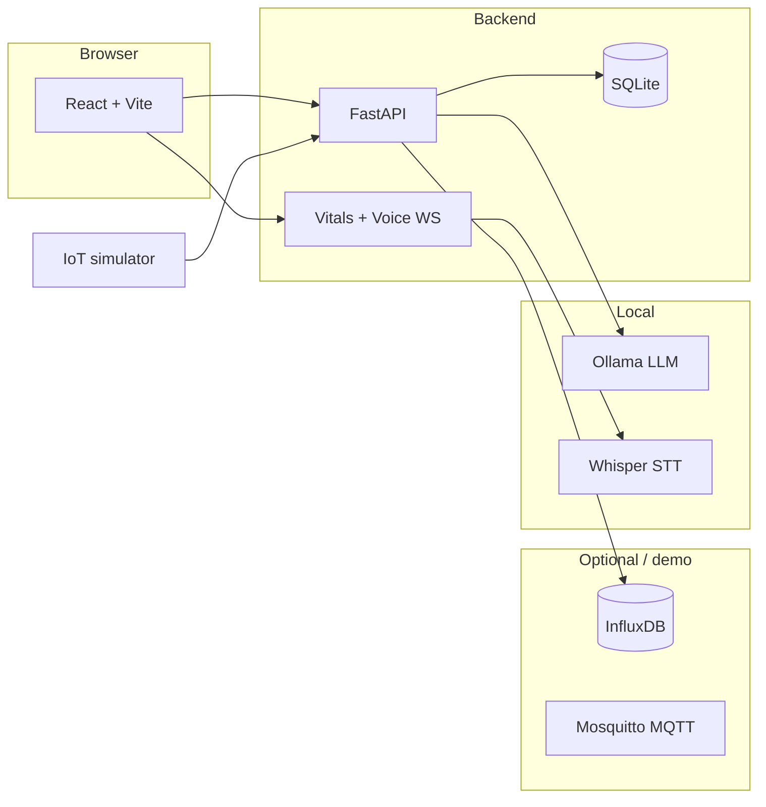

# I-CARE

> **Cloud skeleton (current):** the active app layout and stack live under [`icare/`](icare/) per [`icare/.cursorrules`](icare/.cursorrules) — FastAPI + Supabase (PostgreSQL) + Groq + InfluxDB Cloud + Vite/React. See [`icare/README.md`](icare/README.md).

The sections below describe an earlier local-demo variant (SQLite / Ollama) and may be outdated relative to the `icare/` tree.

Privacy-first, AI-assisted remote healthcare demo: vitals ingestion, threshold alerts, multilingual prescriptions, and a local LLM symptom checker (Ollama). Built as a **student / MITS** project for learning and demonstration—not for clinical deployment.

## Features (demo)

- **Vitals**: IoT simulator posts to FastAPI; live dashboard via WebSocket; InfluxDB optional for history.
- **Alerts**: Threshold breaches create alerts; SMS can be sent via Fast2SMS in production, or **logged only** when `SMS_LOG_ONLY=1`.
- **Symptom checker**: `POST /api/symptoms/analyze` uses recent records + vitals context with BioMistral (fallback Llama 3.2).
- **Voice**: WebSocket voice assistant; say **“Open symptom checker”** to navigate to `/symptoms`.
- **Prescriptions**: Doctor writes Rx in English; Hindi-speaking patients get an auto-generated Hindi `translated_text` when Ollama is available.

## Architecture



## Tech stack

| Layer | Technology |
|--------|------------|
| API | Python 3.11, FastAPI, SQLAlchemy 2 (async), Pydantic v2 |
| DB | SQLite (`aiosqlite`), optional InfluxDB 2 for time series |
| Frontend | React 18, TypeScript, Tailwind, Vite, TanStack Query |
| Realtime | WebSocket (vitals stream, voice PCM pipeline) |
| AI / voice | Ollama (BioMistral, Llama 3.2), faster-whisper, optional TTS |

## Repository layout

- `icare/backend` — FastAPI app (`main.py`), routers, services, models, `scripts/seed_data.py`
- `icare/frontend` — React SPA
- `icare/iot` — Vitals simulator and device helpers
- `docker/` — Mosquitto config
- `docker-compose.yml` — Backend, frontend, InfluxDB, Mosquitto with persistent volumes
- `scripts/setup.sh` — Environment checks, dependencies, DB seed
- `scripts/demo.sh` — API + Vite on port 3000 + vitals simulator

## Prerequisites

- **Python 3.11+**
- **Node.js 18+**
- **Ollama** (recommended): [ollama.com](https://ollama.com) — models `biomistral` and `llama3.2`
- Optional: **NVIDIA GPU** + CUDA for Whisper / faster inference
- Optional: **Docker** + Docker Compose v2

## Quick setup (Unix / Git Bash)

From the repository root:

```bash
chmod +x scripts/setup.sh scripts/demo.sh
./scripts/setup.sh
```

This script checks Python and Node versions, optionally verifies Ollama and CUDA, installs backend (`icare/backend/.venv`) and frontend dependencies, copies `.env.example` → `icare/backend/.env` if missing, creates `icare/frontend/.env.local` with the demo patient UUID, and runs `python -m scripts.seed_data` inside the backend venv.

## Manual setup (Windows PowerShell)

```powershell
cd icare/backend
python -m venv .venv
.\.venv\Scripts\Activate.ps1
pip install -r requirements.txt
Copy-Item ..\..\.env.example .\.env
# Edit .env — set SECRET_KEY, optional Influx/Fast2SMS

python -m scripts.seed_data

cd ..\frontend
npm install
@"
VITE_API_BASE_URL=
VITE_DEFAULT_PATIENT_ID=11111111-1111-4111-8111-111111111111
"@ | Set-Content -Encoding utf8 .env.local
```

## Docker Compose

From the repo root:

```bash
docker compose up --build
```

- Frontend: [http://localhost:3000](http://localhost:3000) (uses `VITE_API_BASE_URL=http://localhost:8000`)
- API: [http://localhost:8000/docs](http://localhost:8000/docs)
- InfluxDB UI: [http://localhost:8086](http://localhost:8086)
- MQTT: port `1883`

Volumes: `sqlite_data` (API SQLite under `/app/data`), `influxdb_data`, `mosquitto_data`.

After the first backend start, run seeding **inside** the backend container if you need demo users (or mount a pre-seeded DB).

## Run the local demo

**Option A — `demo.sh` (starts API on 8000, Vite on 3000, simulator):**

```bash
./scripts/demo.sh
```

Open [http://localhost:3000](http://localhost:3000).

**Option B — two terminals:**

```bash
# Terminal 1
cd icare/backend && uvicorn main:app --reload --host 0.0.0.0 --port 8000

# Terminal 2
cd icare/frontend && npm run dev -- --host 0.0.0.0 --port 3000
```

**Option C — default Vite port 5173** with API proxy:

```bash
cd icare/frontend && npm run dev
```

Then open [http://127.0.0.1:5173](http://127.0.0.1:5173) (proxies `/api`, `/auth`, `/ws` to port 8000).

**Vitals simulator** (demo patient UUID from seed):

```bash
python icare/iot/simulator.py --patient-id 11111111-1111-4111-8111-111111111111 --scenario normal --api-url http://127.0.0.1:8000
```

**Threshold / alert spike** (high HR — watch dashboard alerts; with `SMS_LOG_ONLY=1`, SMS appears in API logs):

```bash
python icare/iot/simulator.py --patient-id 11111111-1111-4111-8111-111111111111 --scenario hr_spike --api-url http://127.0.0.1:8000
```

## Demo accounts (after `seed_data`)

| Role | Email | Password | Notes |
|------|-------|----------|--------|
| Patient | `demo@patient.com` | `demo123` | Rajesh Kumar, Hindi |
| Doctor | `demo@doctor.com` | `demo123` | Dr. Priya Sharma |

Patient UUID is also written to `icare/backend/.demo_env` as `DEMO_PATIENT_ID`.

## End-to-end checklist (manual)

1. **Register → Login → Dashboard**: Use `/register` or demo patient; confirm live vitals update while the simulator runs.
2. **Vitals spike → Alert**: Run `hr_spike` scenario; confirm alert banner / pipeline; with `SMS_LOG_ONLY=1`, check backend logs for SMS log lines instead of real sends.
3. **Symptoms + AI**: Open **Symptom checker**, enter text, **Analyze** — response should reference vitals context (expand “Vitals context” if needed).
4. **Voice**: Open voice assistant, say **“Open symptom checker”** — app navigates to `/symptoms`.
5. **Doctor → Rx → Patient**: Log in as doctor → **Write Rx** for the demo patient UUID → log in as patient → **Prescriptions** — see English + Hindi translation.

## Screenshots

_Add screenshots here: dashboard, symptom checker, prescriptions, alerts._

## Troubleshooting

- **`no such column` / schema errors after `git pull`**: SQLite keeps the old file. Stop the API, delete `icare/backend/icare.db` (or the path in your `DATABASE_URL`), then run `python -m scripts.seed_data` again so `create_all` rebuilds tables.

## Development notes

- CORS is open in development; lock down for any real deployment.
- `SMS_LOG_ONLY` is enabled in `docker-compose.yml` for safe demos.
- Coqui TTS may be skipped on Python 3.12+ per `requirements.txt` markers.

## Attribution

**I-CARE** is developed as part of academic work at **Madhav Institute of Technology and Science (MITS), Gwalior** — a student project exploring assistive healthcare technology, not a certified medical device.
